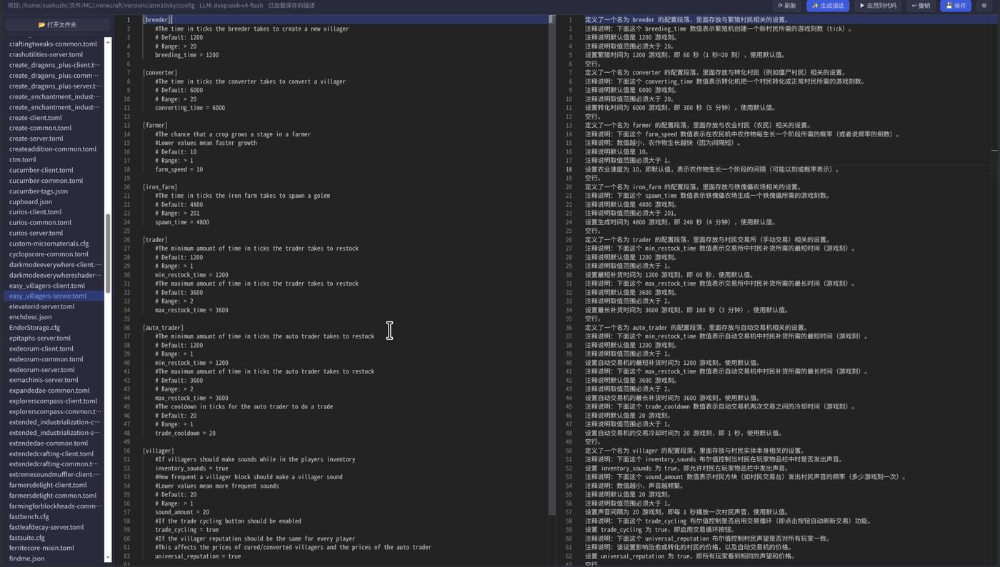
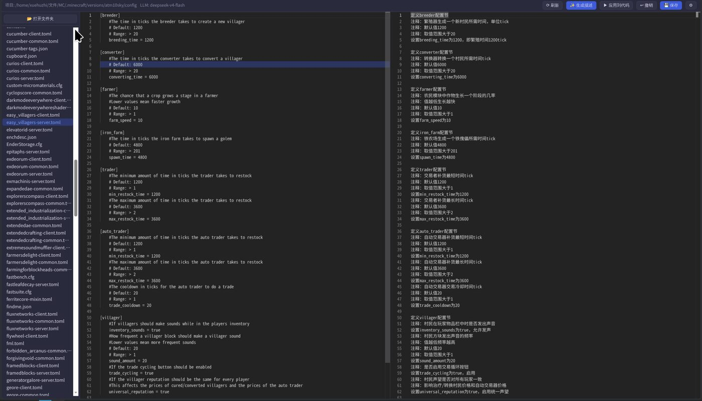

# NL Code Mirror — 自然语言编程镜像编辑器

> **定位:帮小白读懂和修改代码 / 英文配置文件**
> 看不懂别人的代码?看不懂 MC 整合包那些英文 mod 配置?让 AI 逐行翻译成大白话,你直接用中文改,AI 帮你改回代码/配置。

一个三栏布局的本地 Web 工具,让 AI **逐行解释代码/配置**,并支持**双向同步修改**:

```
┌──────────┬──────────────────┬──────────────────┐
│ 文件树    │      代码/配置     │    逐行解释(可编辑) │
│ 📁 项目   │   Monaco 编辑器   │   AI 大白话翻译     │
└──────────┴──────────────────┴──────────────────┘
```

- **右栏是左栏的逐行镜像**:行号一一对应、滚动同步、点击任意一侧某行,另一侧同步高亮
- 改代码 → 点「✨ 生成描述」→ AI 逐行解释(解释会保存,下次打开自动加载)
- 改描述(自然语言)→ 点「▶ 应用到代码」→ AI 按你的描述修改代码,可撤销
- **典型场景**:
  - 读懂别人的/ AI 生成的代码
  - 修改 MC 整合包的 mod 配置文件(Almost Unified、FTB、Forge/NeoForge 的 `.toml`/`.json`/`.cfg` 等)
  - 用自然语言提要求(如"把这个上限从 5 改成 20"),AI 负责改

---

## 下载与安装

> 💡 **推荐:Web 版(源码包)只有几十 KB,安装 Node.js 后即可使用;桌面版零依赖但体积大(100MB+)。**

### 方式一:Web 版 ⭐ 推荐(小,需要 Node.js)

**先装 Node.js(只需一次):**

| 系统 | 步骤 |
|---|---|
| Windows | 打开 https://nodejs.org 下载 LTS 版 .msi → 双击安装,一路下一步 |
| macOS | 打开 https://nodejs.org 下载 LTS 版 .pkg → 双击安装 |
| Linux | Debian/Ubuntu: `sudo apt install nodejs npm`;Arch: `sudo pacman -S nodejs npm` |

验证安装:打开终端/命令提示符,输入 `node -v`(看到 v18 以上就 OK)。

**然后:**
解压缩nl-code-mirror-v0.2.0.zip 后进入目录nl-code-mirror
```bash
npm install
npm start
```

浏览器打开 http://127.0.0.1:8787

### 方式二:桌面版(零依赖,免装 Node)

| 平台 | 文件 | 用法 |
|---|---|---|
| Windows | `NL Code Mirror 0.2.0.exe` | 下载后双击运行 |
| Linux | `NL Code Mirror-0.2.0.AppImage` | 下载后双击运行(需 FUSE;Ubuntu 先 `sudo apt install libfuse2`) |
| macOS | GitHub Actions 构建产物(dmg) | 打开后需右键→打开(未签名) |

> 桌面版内置 Node 运行时,下载即用,适合不想装任何东西的用户。

---

## 首次使用

1. 首次打开会弹出**目录选择器**,选一个工作目录(如你的项目文件夹),点「✓ 选择此目录」
2. 点右上角 **⚙ 设置**,配置 AI:

| 配置项 | 说明 | 示例 |
|---|---|---|
| AI 提供商 | 一键预设,自动填 Base URL 和模型列表 | DeepSeek / OpenAI / OpenRouter / Kimi / GLM / 通义 / 硅基流动 / Groq / Ollama |
| Base URL | OpenAI 兼容接口地址 | Ollama:`http://127.0.0.1:11434/v1`;DeepSeek:`https://api.deepseek.com` |
| API Key | 接口密钥 | Ollama 可留空;DeepSeek 填 `sk-...` |
| 模型 | 模型 ID(预设内可下拉选,也可自定义) | DeepSeek:`deepseek-v4-flash` / `deepseek-chat` |
| 工作目录 | 项目根目录 | 可直接改或点「📂 浏览…」选择 |
| AI 解释详细度 | 0=纯小白,100=编程大佬 | 新手调低,老手调高 |
| 可修改的文件扩展名 | 额外支持的文件后缀 | `.cfg, .properties, .lang` |

> DeepSeek V4 模型(`deepseek-v4-flash`/`deepseek-v4-pro`)会自动带上 thinking 参数,无需手动配置。

3. 左侧点开一个文件 → 点 **✨ 生成描述**,右侧出现逐行中文解释

---

## 使用说明

### 逐行解释(代码/配置 → 中文大白话)
- 打开文件 → 「✨ 生成描述」,AI 按行解释(大白话、纯客观,不带主观评价)
- 解释**自动保存**:下次打开同一文件(代码没变)直接显示,不重复花钱/花时间
- 长文件自动**分段生成**(每 80 行一段),行号精确对齐,不会"几十行一句话概括"

### AI 解释详细度效果对比(设置 → 详细度:0=小白,100=大佬)

同一个 Minecraft 配置文件(easy_villagers-server.toml,村民便捷交易插件),详细度拉低(小白)和拉高(大佬)的解释差别:

| 新手模式(详细度低) | 老手模式(详细度高) |
|---|---|
|  |  |

### 自然语言改代码(描述 → 代码)
1. 直接编辑右栏任意行的描述(空行 = 保持原样;写"删除"就会删对应代码)
2. 点 **▶ 应用到代码**,AI 按描述修改左侧代码
3. 不满意点 **↩ 撤销**

### 用户修改高亮 + 保存
- 你手动改过的行(代码或描述)**黄色加粗高亮**,一眼看出哪些是你改的
- 点 **💾 保存**(或 Ctrl+S)把代码写回文件;保存后高亮消失

### 导航与联动
- 点击左栏代码某行 → 右栏同步高亮 + 跳转;反之亦然
- 两栏滚动始终同步,行号严格对齐


### 文件树
- 「📂 打开文件夹」:目录选择器浏览任意路径(含隐藏目录,如 `.minecraft`)
- 「⟳ 刷新」:重新扫描文件树;自动跳过 `node_modules`、`dist`、`build` 等大目录
- 支持常见代码/配置格式 + 你自定义的扩展名

---

## 数据与隐私

- 设置(含 API Key)只存在**浏览器 localStorage**,不会写入磁盘文件
- 代码与解释存于 `~/.local/share/nl-code-mirror/descs/`(按项目文件分开,可随时删除)
- 唯一的网络请求是发给你在设置里配置的 AI 接口(Base URL 指向哪就发到哪)
- 服务只绑定 `127.0.0.1`,不对外暴露

## 构建桌面版(开发者)

```bash
npm install
npm run dist:linux   # Linux AppImage
npm run dist:win     # Windows portable exe
npm run dist:mac     # macOS dmg(需在 Mac 上执行)
```

产物在 `dist/` 目录。推 tag 到 GitHub 时,`.github/workflows/build.yml` 会自动在三个平台构建并上传产物。

## 项目结构

```
nl-code-mirror/
├── index.html          # 前端入口(三栏界面)
├── app.js              # 前端逻辑
├── style.css           # 前端样式
├── electron/main.js    # 桌面壳(内置后端,免安装 Node)
├── server/server.js    # 后端:文件服务 + 目录浏览 + AI 调用(分段生成/重试/行号归位)
└── package.json        # 唯一运行依赖:monaco-editor(本地提供,不走 CDN)
```

## 常见问题

**Q: 生成描述报"LLM 返回格式异常"?**
A: 后端会自动重试 3 次;若仍失败,检查 Base URL/模型名是否正确、网络能否到达接口。

**Q: DeepSeek 报 model not found?**
A: V4 模型(`deepseek-v4-flash`/`deepseek-v4-pro`)需带 thinking 参数,本工具已自动处理;确认模型名拼写正确。

**Q: 文件树看不到某些目录?**
A: `node_modules`/`dist`/`build` 等被有意跳过;隐藏目录(. 开头)默认显示。


## License

MIT
